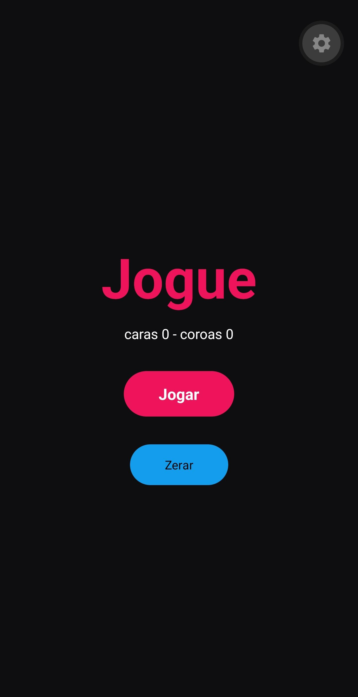
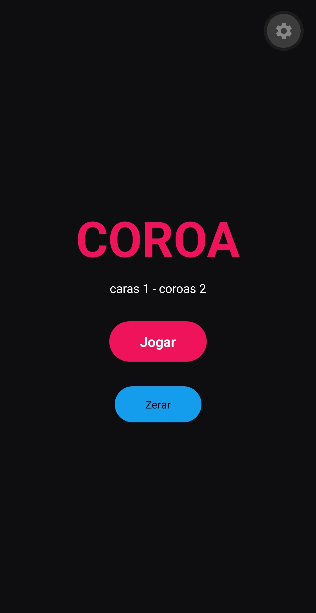

# Mobile Development e IoT | Aula 01 - 21/09/2026

## Contéudo da aula

Utilizamos react native + TypeScript + Expo Go para desenvolver um aplicativo mobile. O aplicativo consiste em um jogo de cara ou coroa com um contador, ele é gerado de forma aleatória e cada vez que você pressiona o botão, o contador é incrementado. Também tem um botão de zerar caso o usuário queira zerar os dois contadores.

 

