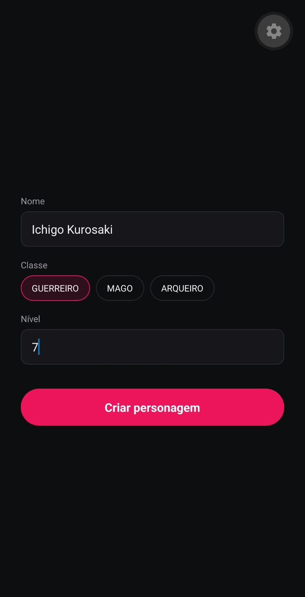

# Mobile Development e IoT | Aula 02 - 28/09/2026

## Conteúdo da aula

Utilizamos react native + TypeScript + Expo Go para desenvolver um aplicativo mobile. O aplicativo é um formulário de RPG para criar seu personagem, você pode colocar nome, escolher a classe e definir o level dele com algumas limitações. Usamos alguns fundamentos em TypeScript e react native para conseguir desenvolver.

### Telas

